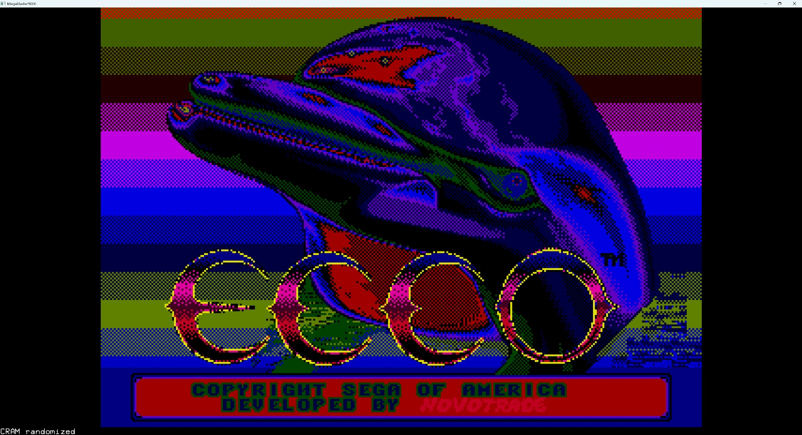
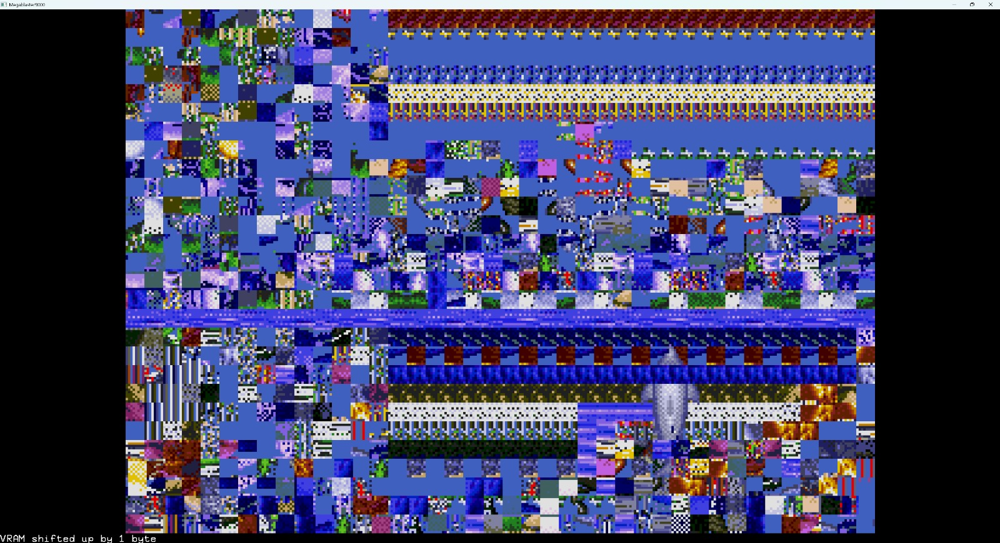
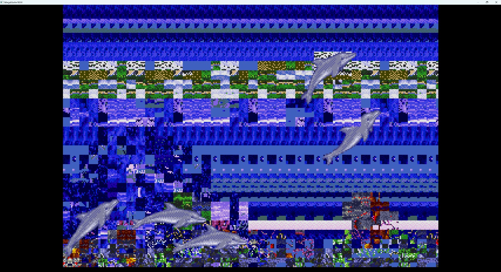

# ChaosDrive

Virtually circuit-bend a Sega Megadrive/Genesis. Take a perfectly good emulator (DGen), and add a number of "creative" features designed to glitch the video and audio drivers.  

Results in a number of weird, wonderful, interesting, insane effects. The software equivalent of jamming a screwdriver into a working system while it's running to "see what happens".

## Examples

### Demo Video

### Sonic 1

    

    

    

    

### Ecco

    

    

    

## Build

### Building - Mac

`./build-mac.sh` - will use homebrew to install dependencies if needed, then build the project.

### Building - Windows

WIP, but you can try the `./build-windows.ps1` file. More info [here](BUILDING_ON_WINDOWS.md).  
Will also periodically drop pre-built Windows binaries in the [releases](https://github.com/richstokes/ChaosDrive/releases).  

### Building - Linux

TBD - probably pretty similar to the MacOS build script

## Run

### Mac / Linux

`./dgen <ROM>`, e.g. `./dgen sonic1.md`

## Windows

Drag a ROM file onto the dgen.exe

## Keys

### Emulator

- Keys A,S,D: ABC on the controller
- Arrow keys: D-Pad on the controller
- Enter: Start button on the controller
- Tab: Reset the console
- Z: Pause/Resume emulation
- Escape: Quit the emulator

### Video Controls

#### VRAM Manipulation

- Key O: Move VRAM contents up one block
- Key L: Move VRAM contents down one block
- Key K: Move VRAM contents "left" one block
- Key ; (semi colon): Move VRAM contents "right" one block
- Key I: Move VRAM contents down a random amount
- Key P: Corrupt a randomly-selected, single byte of VRAM (hold to repeat)
- Key \: Bitwise inversion of all VRAM contents (press again to repeat)

#### CRAM/Color Manipulation

- Key [: Randomize CRAM contents (once, hold to repeat)
- Key ]: Shift CRAM contents up one byte (once, hold to repeat)
- Key Y: Toggle persistent CRAM corruption on
- Key U: Toggle persistent CRAM corruption off

#### Sprite/Scroll Manipulation

- Key R: Fuzz scroll registers (once, press again to repeat)
- Key T: Scramble sprite attributes (X, Y, tile index, etc) - causes sprites to jump around, flicker, disappear, etc.

#### Future Video Features

- Key Q,W,E reserved for future video features

### Audio Controls

- Key X: Enable FM corruption (single press) - results in extremely cursed background music
- Key C: Disable FM corruption (single press)
- Key V: Corrupt DAC/PCM data - effects drums, generally
- Key B: Apply bitcrush effect
- Key N: Detune FM channels/registers (music etc will go out of tune while held)
- Key , (comma): Shift Z80 audio memory up (once, hold to repeat)*
- Key . (period): Shift Z80 audio memory down (once, hold to repeat)

\* Shifting Z80 memory can actually result in corrupting the audio processor's program counter, stack, and critical variables, which causes it to execute invalid instructions or jump to wrong addresses, freezing the system. Sometimes if you step backward it will recover. Room for improvement here!

### General Mayhem

> Will likely result in crashes!

- Key F: Randomly corrupt a byte of main (68K) memory
- Key G: Scramble critical RAM areas
- Key H: Force-Increment the program counter a random small amount
- Key J: Corrupt a random register

## Contributing

PRs welcome.

## Credits/License

Forked from [dgen](https://sourceforge.net/p/dgen/dgen/ci/master/tree/). See the [original Readme](README.original.md) and [Copyright info](COPYING) for more details.
