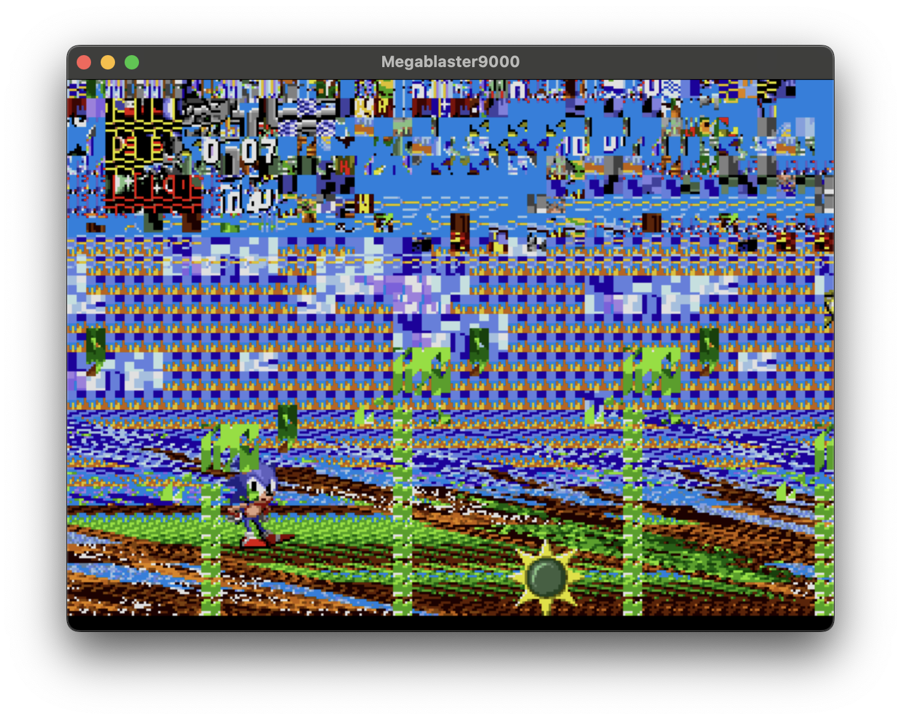
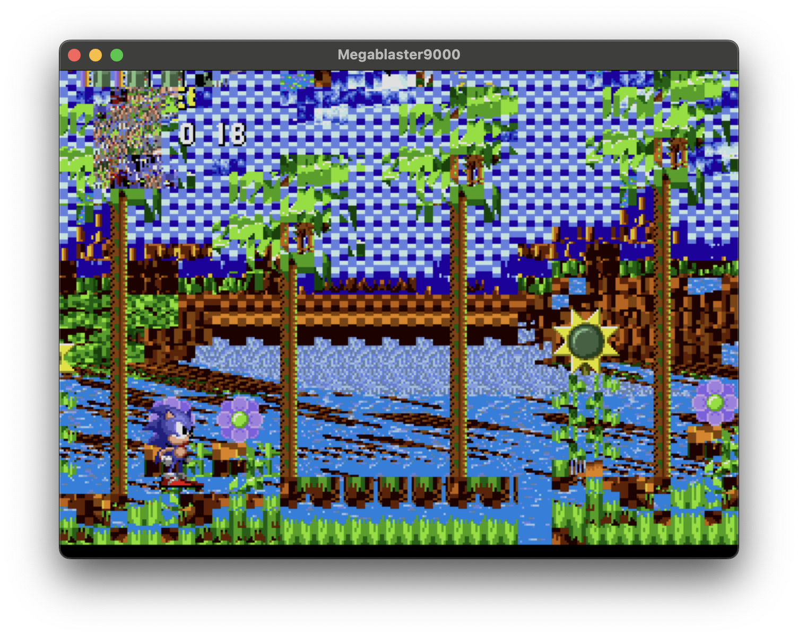
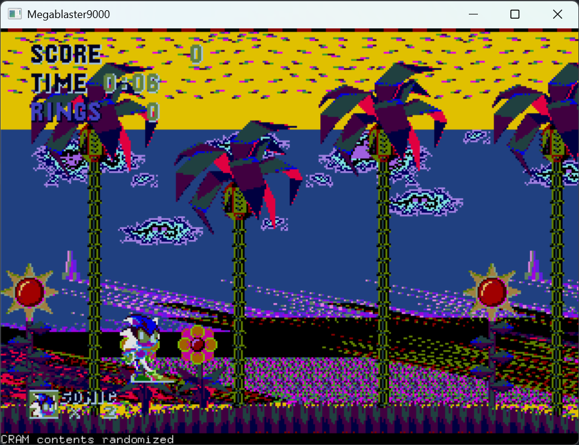
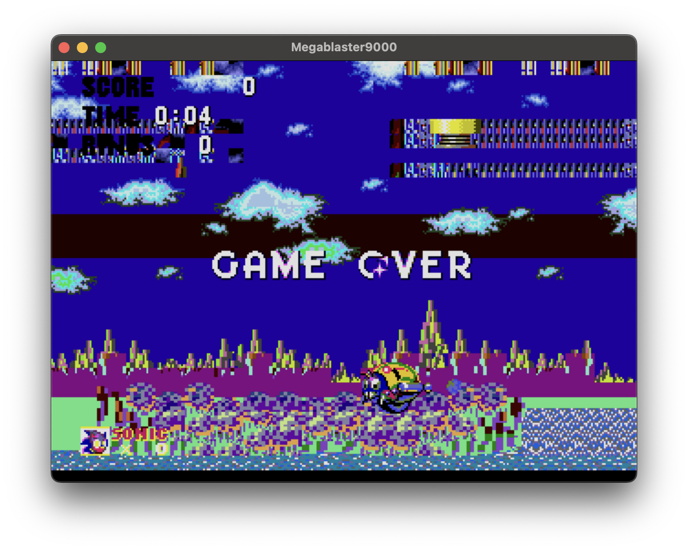
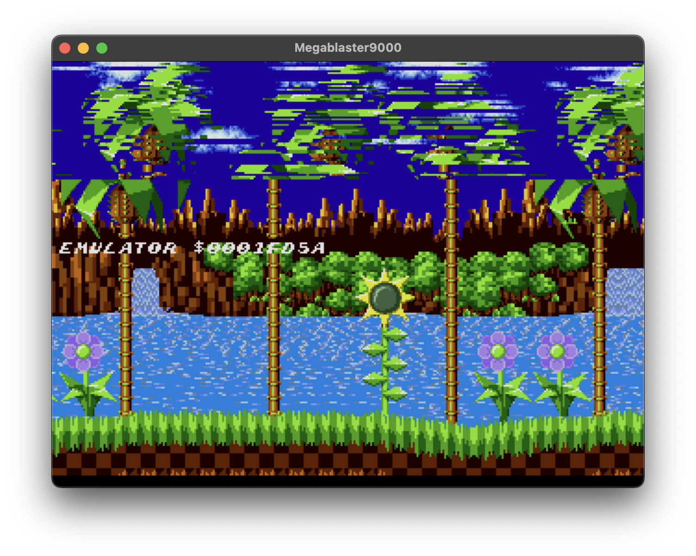

# Megablaster

Virtually circuit-bend a Sega Megadrive/Genesis. Take a perfectly good emulator (DGen), and add a number of "creative" features designed to glitch the video and audio drivers.  

Results in a number of weird, wonderful, interesting, insane effects. The software equivalent of jamming a screwdriver into a working system while it's running to "see what happens".

## Examples

### Sonic 1

    

    

    

    

    

## Build

### Building - Mac

`./buildandrun.sh` - A vibe-coded build script that "works on my machine".  
Installs dependencies via homebrew and then builds the app. More info [here](BUILDING_ON_MACOS.md).

### Building - Windows

WIP, but you can try the `./build-windows.ps1` file. More info [here](BUILDING_ON_WINDOWS.md).  
Will also periodically drop pre-built Windows binaries in the [releases](https://github.com/richstokes/Megablaster/releases) - currently reported not working for everyone, need to look into this.

### Building - Linux

TBD - probably pretty similar to the MacOS build script

## Run

### Mac / Linux

`./dgen <ROM>`, e.g. `./dgen sonic1.md`

## Windows

Drag a ROM file onto the dgen.exe

## Keys

### Emulator

- Keys A,S,D: ABC on the controller
- Arrow keys: D-Pad on the controller
- Enter: Start button on the controller

### Video Controls

- Key 9: Shift VRAM contents up one byte
- Key 0: Shift VRAM contents down one byte
- Key R: Randomly corrupt a chunk of VRAM
- Key P: Randomize CRAM contents (once, hold to repeat)
- Key L: Corrupt a single byte of VRAM with random contents (hold to repeat)
- Key K: Fuzz scroll registers (once, press again to repeat)
- Key I: Toggle persistent CRAM corruption on - causes random color glitches
- Key O: Toggle persistent CRAM corruption off
- Key U: Scramble sprite attributes (X, Y, tile index, etc) - causes sprites to jump around, flicker, disappear, etc.

### Audio Memory Controls

- Key 7: Shift Z80 audio memory up*
- Key 8: Shift Z80 audio memory down*
- Key C: Corrupt audio (YM2612) registers
- Key V: Corrupt audio (SN76496) PSG registers
- Key Q: Detune FM channels/registers (music etc will go out of tune while held)
- Key W: Disable FM corruption (single press)
- Key E: Enable FM corruption (single press) - result in extremely cursed background music
- Key T: Corrupt DAC/PCM data - effects drums, generally

\* Shifting Z80 memory can actually result in corrupting the audio processor's program counter, stack, and critical variables, which causes it to execute invalid instructions or jump to wrong addresses, freezing the system. Sometimes if you step backward it will recover. Room for improvement here.

### General Mayhem

> Will likely result in crashes!

- Key J: Randomly corrupt a byte of main (68K) memory
- Key H: Scramble critical RAM areas

## Contributing

PRs welcome.

## Credits/License

Forked from [dgen](https://sourceforge.net/p/dgen/dgen/ci/master/tree/). See the [original Readme](README.original.md) and [Copyright info](COPYING) for more details.
