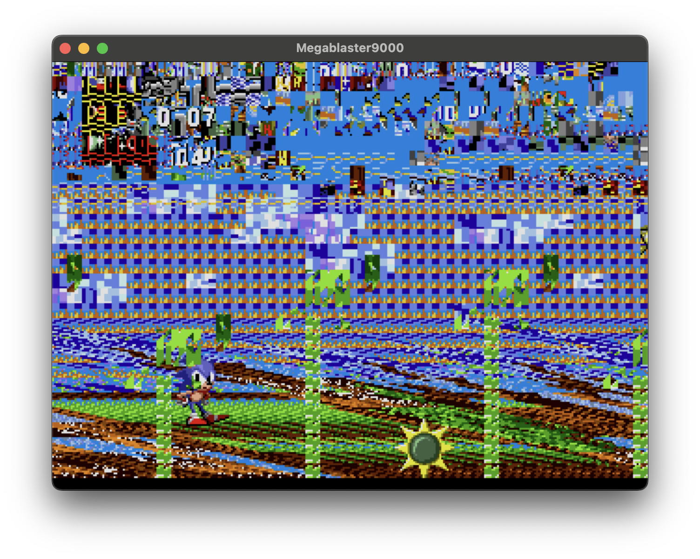
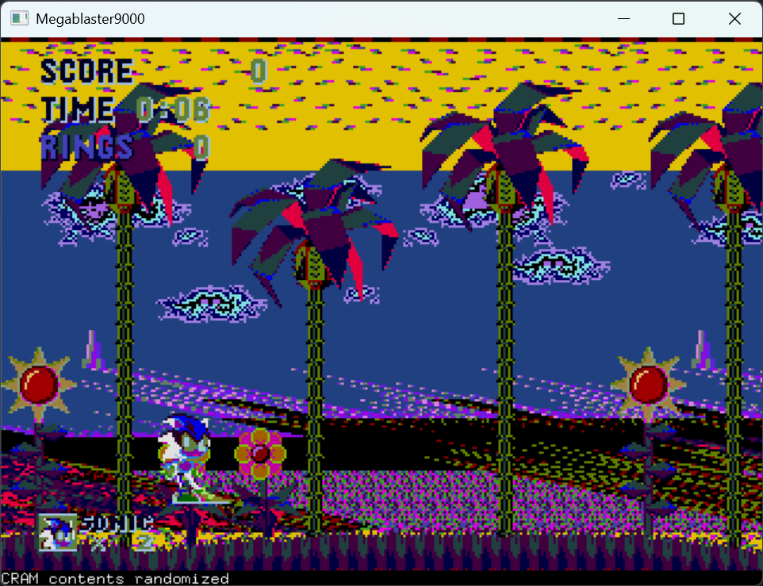
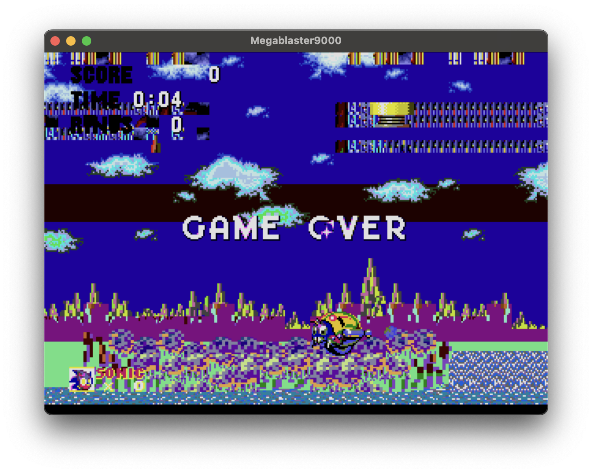
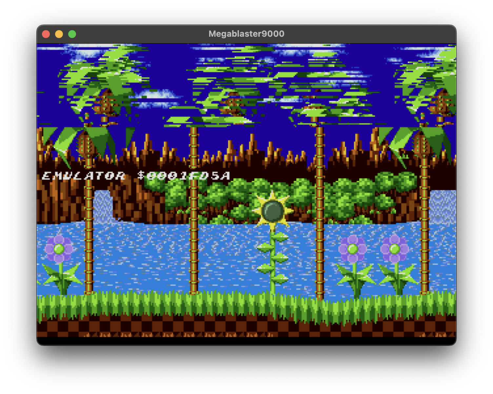
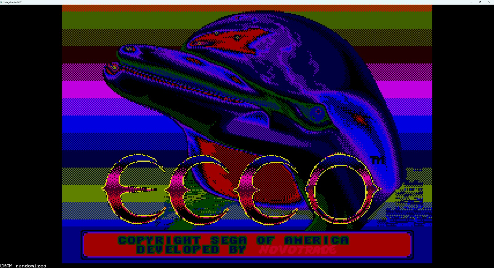
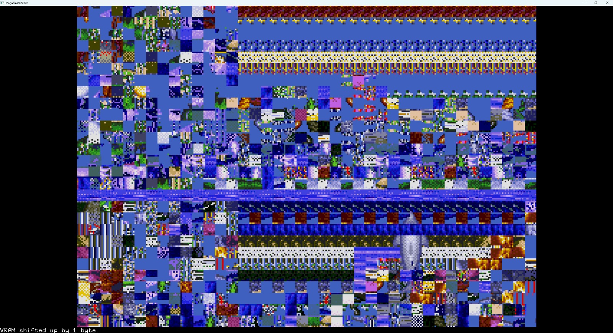
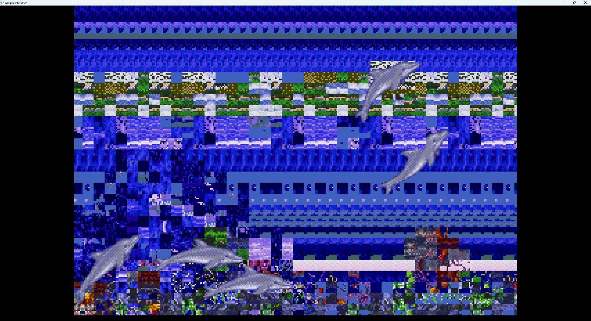

# ChaosDrive

Virtually circuit-bend a Sega Megadrive/Genesis. Take a perfectly good emulator and add a number of "creative" features designed to glitch the video and audio systems.

Results in a number of weird, wonderful, interesting, insane effects. The software equivalent of jamming a screwdriver into a working system while it's running to "see what happens".

**Try it now at [chaosdrive.online](https://chaosdrive.online)**, just load a ROM and have fun!

## Examples

### Sonic 1

<p align="center">
    
</p>
<p align="center">
    
</p>
<p align="center">
    
</p>
<p align="center">
    
</p>

### Ecco

<p align="center">
    
</p>
<p align="center">
    
</p>
<p align="center">
    
</p>

## Quick Start

### Hosted version

Visit **[chaosdrive.online](https://chaosdrive.online)**, load a ROM, and start glitching. Nothing to install.

### Run locally

```bash
cd web
./run.sh
```

This will install all dependencies (Emscripten SDK, npm packages, etc.), build the WASM binary, and start a local dev server. Open the URL it prints (default `http://localhost:9000`) and load a ROM file.

## Keys

### Emulator

- **A, S, D** — A / B / C buttons
- **Arrow keys** — D-Pad
- **Enter** — Start
- **Tab** — Reset (clears all hacks + resets emulator)

### VRAM Manipulation

- **O** — Shift VRAM up (hold to repeat)
- **L** — Shift VRAM down (hold to repeat)
- **K** — Shift VRAM left (hold to repeat)
- **;** — Shift VRAM right (hold to repeat)
- **I** — Shift VRAM down by random amount (hold to repeat)
- **P** — Corrupt a single random VRAM byte (hold to repeat)
- **\\** — Bitwise invert all VRAM contents

### CRAM / Color Manipulation

- **[** — Randomize CRAM contents (hold to repeat)
- **]** — Shift CRAM up one byte (hold to repeat)
- **Y** — Enable persistent CRAM corruption
- **U** — Disable persistent CRAM corruption

### Sprite / Scroll Manipulation

- **Q** — Corrupt VSRAM / vertical scroll (column melt effect, hold to repeat)
- **W** — H-scroll waviness (per-line wobble effect, hold to repeat)
- **R** — Fuzz scroll registers
- **T** — Scramble sprite attributes (X, Y, tile index, etc)

### Audio Controls

- **X** — Enable FM corruption (extremely cursed background music)
- **C** — Disable FM corruption
- **V** — Corrupt DAC/PCM data (hold to repeat)
- **B** — Bitcrush audio (hold to repeat)
- **N** — Detune FM channels (hold to repeat)
- **Z** — PSG noise blast (hold to repeat)
- **,** — Shift Z80 audio memory up\*
- **.** — Shift Z80 audio memory down\*

\*Shifting Z80 memory can corrupt the audio processor's program counter and stack, causing it to execute invalid instructions or jump to wrong addresses, sometimes freezing the audio system. Stepping backward may recover it.

### General Mayhem

> ⚠️ Will likely result in crashes!

- **F** — Corrupt a random byte of 68K RAM (hold to repeat)
- **G** — Scramble critical RAM areas (hold to repeat)
- **H** — Increment the program counter by a random amount
- **J** — Corrupt a random CPU register
- **E** — Flip VDP display mode (interlace, width, shadow/highlight)
- **/** — Flip random game logic variables (lives, score, position, etc)

## Project Structure

### `web/` — WebAssembly version (recommended)

The current, actively-developed version. Built on a [Genesis Plus GX](https://github.com/nicoya/wasm-genplus) WebAssembly fork. Runs in any modern browser — no native dependencies needed at runtime.

See [`web/run.sh`](web/run.sh) to build and run.

### `original_attempt/` — DGen native version (archived)

The original version of ChaosDrive, built as a fork of the [DGen](https://sourceforge.net/p/dgen/dgen/ci/master/tree/) emulator. Requires native compilation (SDL, etc.) and only ran as a desktop app. Kept here for posterity and reference. See its own [README](original_attempt/README.md) for build instructions.

## Contributing

PRs welcome. We still have unused buttons! What other crazy effects can you come up with?
